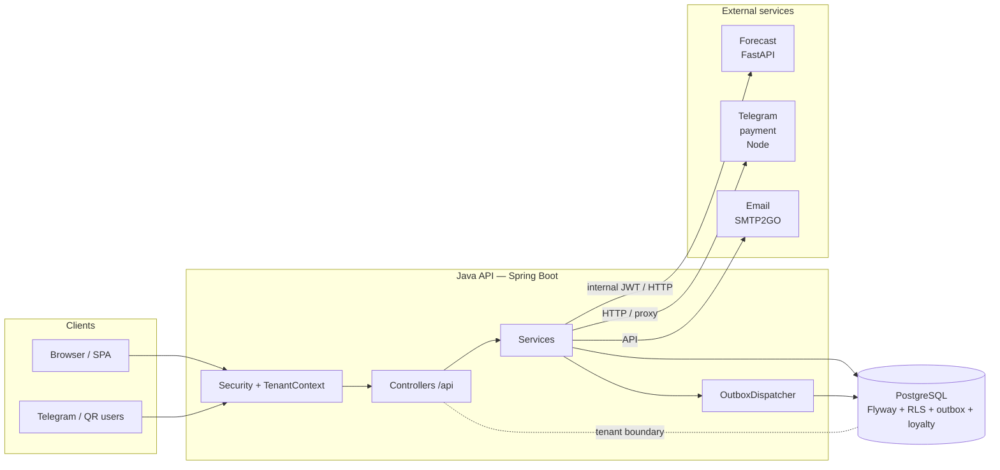

# Architecture — overview

**Purpose:** a one-page system map.  
**Deep dive:** [TECHNICAL_DOCUMENTATION.md](TECHNICAL_DOCUMENTATION.md) (Russian, full onboarding).  
**Outbox → loyalty (actual delivery semantics, idempotency, `SKIP LOCKED`):** [OUTBOX_LOYALTY_SEMANTICS.md](OUTBOX_LOYALTY_SEMANTICS.md).  
**Runbook / ops:** [PRODUCTION_RUNBOOK.md](PRODUCTION_RUNBOOK.md), [BACKUP_RECOVERY.md](BACKUP_RECOVERY.md).

---

## 1. System inventory (concise)

| Area | What it is in this repo |
|------|-------------------------|
| **HTTP** | Spring MVC REST under `/api/...` (admin, staff, public ordering, loyalty, analytics, …); **Actuator** `health` / `metrics` for ops; **OpenAPI** via Springdoc (`/api-docs`, `/swagger-ui.html`). |
| **Auth / security** | Spring Security; **JWT** (access/refresh) with cookies for browser flows; public routes for auth bootstrap, health, some Telegram/QR entrypoints; **CSRF** where cookie session applies; **rate limits** (Bucket4j, in-process). |
| **DB** | **PostgreSQL**; **Flyway** migrations `src/main/resources/db/migration`; JPA (Hibernate). |
| **Multi-tenant / RLS** | `TenantContext` (restaurant / location) + `TenantAwareDataSource` (`SET LOCAL` for session vars); **PostgreSQL RLS** policies on tenant-scoped tables; optional **non–tenant-superuser** app DB roles (see env docs). |
| **Outbox** | Table `outbox_events`; `OutboxDispatcherService` **claims** rows (with PostgreSQL `SKIP LOCKED` where applicable) and calls domain handlers (e.g. loyalty). |
| **Schedulers** | Spring `@Scheduled` (outbox tick, booking notifications, token cleanup, forecast hooks, etc.); **ShedLock** (JDBC) to avoid duplicate work in multi-instance setups. *Disabled in test profile via `spring.task.scheduling.enabled=false`.* |
| **External integrations** | **Forecasting:** FastAPI service — Java calls with internal JWT; no direct DB from Python. **Telegram / QR ordering:** dedicated flows + optional **Telegram payment** microservice (Node) proxied from Java. **Email:** SMTP2GO (API). **Redis** in compose for some services; backend rate limit is in-memory (see code comments / env). |

---

## 2. Components (logical)

- **API controllers** — HTTP mapping, validation, DTOs.  
- **Services** — business rules, transactions, orchestration.  
- **Persistence** — JPA repositories, native SQL where needed, Flyway for schema.  
- **Outbox** — durable hand-off for work that must not be lost with the HTTP request (e.g. after order close).  
- **Loyalty pipeline** — campaign / accrual logic guarded by idempotency at **order** level (`loyalty_order_accruals` composite key).  
- **Observability** — Actuator metrics; logging (see `application.yml`).

---

## 3. Data flow (simplified)

1. **Request** hits Spring Security → JWT / public path → `TenantFilter` / context set.  
2. **Business operations** use JPA; **RLS** enforces row visibility in PostgreSQL even if a query forgets a filter.  
3. **Order lifecycle** can emit **outbox** rows; the **scheduler-driven dispatcher** processes pending rows, with retries and stuck-recovery.  
4. **Loyalty accrual** for an order: handler runs; **at most one** successful accrual per `(restaurant_id, order_id)` via DB idempotency guard + handler checks.

---

## 4. Trust boundaries

| Boundary | Intuition |
|----------|-----------|
| **Client ↔ API** | Authenticated / rate-limited API; no trust in `restaurantId` from body without authz checks. |
| **API ↔ DB** | Tenant JDBC role must not be superuser in production (RLS must apply). |
| **API ↔ Forecast service** | Internal JWT; forecast reads order aggregates **only** through Java-controlled endpoints. |
| **API ↔ Telegram payment** | Network trust + shared secrets; payment service is a separate deployable. |

---

## 5. Failure modes (selected)

- **Outbox row fails:** status moves to `RETRY` (and similar); dispatcher retries; **stuck** `PROCESSING` rows are recovered after a time threshold. *Semantics: at-least-once delivery with idempotent handling for loyalty at order level.*  
- **DB unavailable:** Hikari / JDBC errors; health checks reflect dependency failure.  
- **Cross-tenant access:** RLS + application filters aim to return empty/deny even if a repository query is wrong.  
- **Partial deploys:** Flyway `validate-on-migrate` catches migration drift in normal pipelines.

---

## 6. Flagship slice: **Outbox → Loyalty (reliability story)**

1. A domain event (e.g. order closed) is **written to `outbox_events`** in the same transaction that closes the business fact where possible.  
2. `OutboxDispatcherService` **claims** work using locking semantics safe under concurrency.  
3. The loyalty path checks **`loyalty_order_accruals`** so **duplicate delivery** of the same logical event does not double-credit.  
4. This is the main **reliability** talking point: **durable work queue + idempotent effect** on the consumer side.

*See [OUTBOX_LOYALTY_SEMANTICS.md](OUTBOX_LOYALTY_SEMANTICS.md) for the precise story. Reconciliation: `GET /api/platform/loyalty/accrual` (HEAD_ADMIN). Tests: `OutboxExactlyOnceIT`; demo: `scripts/demo-outbox-loyalty.sh`.*

---

## 7. Diagram (Mermaid)

*Tenant boundary: all tenant data paths assume correct `restaurant_id` / RLS context; the platform role is reserved for explicit cross-tenant jobs.*

---

*Last updated with repository layout; for file-level detail prefer [TECHNICAL_DOCUMENTATION.md](TECHNICAL_DOCUMENTATION.md).*
